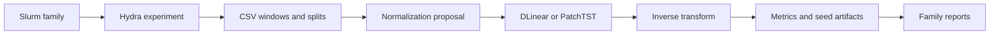

# Code architecture

This page maps the normalization proposal to the training and reporting code.
The paper-ready formulation is in
[`method_overview.pdf`](../latex/method_overview.pdf).

## Scientific path

| Owner | Responsibility |
|---|---|
| `src/data/` | Dataset configuration, chronological splits, and sampled windows |
| `src/proposal/normalizations.py` | RevIN and MIN transformations |
| `src/external_models/` | Pinned source-adapted DLinear and PatchTST |
| `src/model_loading/` | Composition of normalization and backbone |
| `src/training/` | Fixed-budget optimization and evaluation |
| `src/pipeline/` | Run identity, manifests, and repeat selection |
| `src/results/` | Seed aggregation and family tables |

For each input window, the proposal computes a location and scale, transforms
the input, calls the unchanged backbone, and reverses or modulates the output
transform. MIN differs from RevIN only at the globally learned output mapping.

## Execution path

1. A root Slurm front chooses one normalization question.
2. `src/slurm/run_revin_experiment.sh` expands the selected profile.
3. `src/scripts/experiment.py` builds data, proposal, and backbone.
4. The training stage completes missing seeds.
5. The table stage reads only completed manifests and writes
   `outputs/reports/<family>/<mode>/`.

## Important boundaries

- Normalization code does not own orchestration, reporting, or plotting.
- External backbones remain byte-aligned with TimeTensors.
- Loss, normalization, and backbone are separate experimental axes.
- One seed owns partitioning, sampling, initialization, and optimization.
